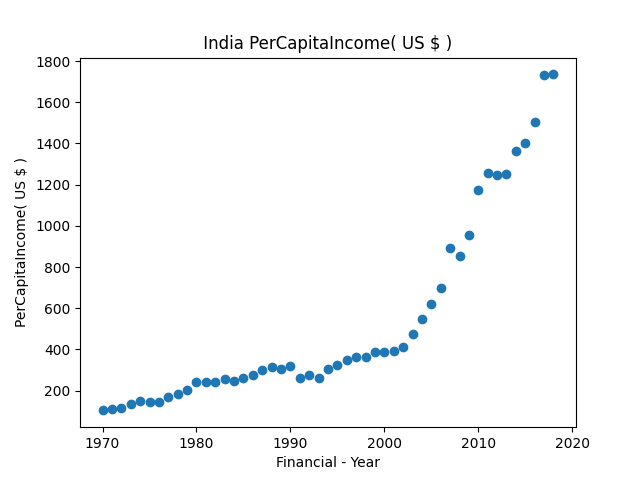

<h1> Used Polunomial regression to predict India National Per Capita Income</h1>
<h2>Data Source:World Bank DataBase inside:indianationalincome1970.csv showing data of national income from 1970</h2>
<h3>Python Code:predictnationalincomeofacountry.py </h3>

